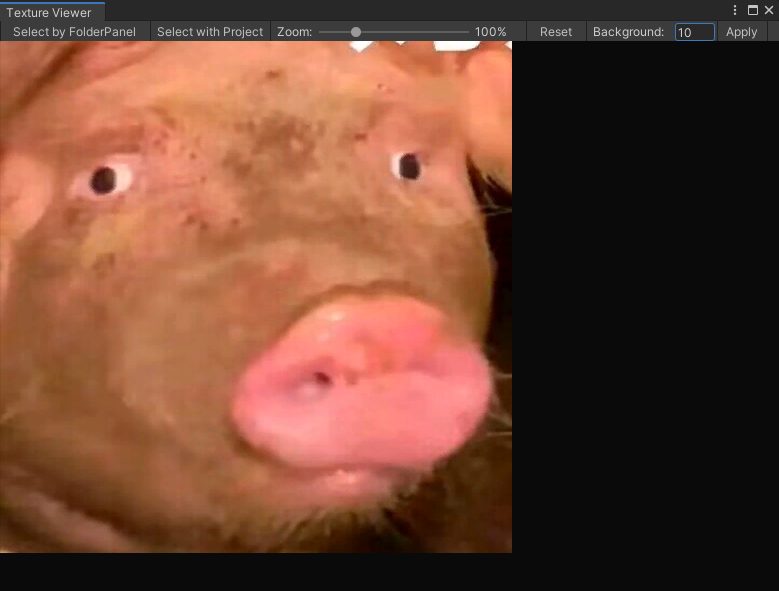

# CharSui's Texture Previewer

Unity默认的Inspector在查看贴图的时候没办法放大，但是又想要看看经过压缩设置之后的贴图精度怎么样，遂让DeepSeek生成代码。
于是我们得到了一个材质预览器。  
Unity's default Inspector doesn't allow zooming in when viewing textures, but I wanted to check the precision of the texture after compression settings were applied, so I asked DeepSeek to generate the code. As a result, we now have a texture previewer.

# 功能 - Feature
## 随鼠标缩放 Zoom

鼠标和滑条都可以用  
Both the mouse and the slider can be used.
## 切换预览底色 BackgroundColor

在Background的后面输入具体的值（1-255），点击Apply应用  
Enter a specific value (1-255) after Background, then click Apply to confirm.
# 怎么用？
默认的窗口打开放在了`Window/Texture Previewer`  
You can open the window form this EditorToolBarPath.
## 通过文件选择器加载 - FolderPanel

## 通过Project界面加载 - Project

## 【不稳定】:通过Inspector加载
导入Sample的InspectorExtension，之后你的贴图相关的Importer底部就会有一个"预览"按钮，点进去就好了。  
**Warning**: the inspectorExtension have some bug.  
Import the InspectorExtension of the Sample, and then you will find a "预览" button at the bottom of your texture-related Importer. Just click it to proceed.

